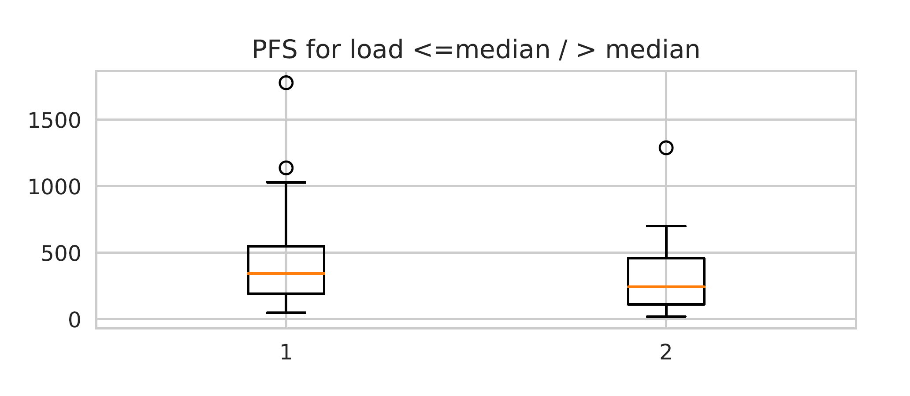

# Investigating correlations between PFS and mutational/demographical feautures based on Liu, et al. (Nature Communications, 2017)

**Author**: Leonidas Tsepenekas ([ltsepene@cs.umd.edu](mailto:ltsepene@cs.umd.edu))
**Date**: November 14, 2018

## Plan of investigation

Liu, et al. [1] performed discovery of mutational signatures analysis in chemotherapy resistant muscle-invasive bladder cancer for three cohorts. The first cohort involved pre-treatment mutations, the second post-treatment mutations and the last post-only mutations for the same set of patients. Their study also includes information about the progression-free survival (PFS) period for each patient. In this project, our goal is investigate interesting factors that may correlate with PFS. In the discussion that follows, we measure PFS as the days passed between cystectomy and the day the cancer reoccured. 

We performed the following set of experiments:
1. For each patient we computed the pre-treatment and post-only treatment signature profile, using the NMF approach of Liu et al., that we implemented for project 1. The goal of this experiment was to identify any relationship between pre and post-only signature profiles.
2. We tried to associate PFS with specific signatures in post-only treatment signature profiles. 
3. We tried to associate PFS with specific signatures in pre-treatment signature profiles. 
4. We tried to associate PFS with the age and sex of the patients in our cohort.
5. We tried to associate PFS with mutational load in all three cases considered. That is for, pre-treatment, post-treatment, and post-only treatment mutations.

## Data
Initially, the data we used included the mutational counts given to us for the first project. Those data include 30 samples for the pre-treatment and post-treatment case, but only 29 for the post-only case. We used those datasets to calculate signatures and exposures, as in project 1, but also mutational burdens. All the additional data required were available in Supplementary material of the Liu et al. submission website https://www.nature.com/articles/s41467-017-02320-7#Sec29 (Supplementary Data 1). To match demographic features and PFS information to each patient we used the patient ids provided in both the datasets of project 1 and the above supplementary table. Furthermore, we had to identify which patient was missing in the post-only case and make the necessary changes in our code in order to correctly handle that.

## Experiment 1 
For this experiment we tried to infer if there are any interesting correlations between pre-treatment and post-only treatment signature profiles. We chose to study the post-only scenario, since our NMF implementation from project 1 was able to fully reproduce the results for this case, compared to the post-treatment one. Our goal was to possibly identify if there exists a pre-treatment profile that strongly correlates with increased activity of the newly discovered cisplatin signature. 

To compute signatures and exposures we used our code from project 1, setting the effective number of signatures to the values used in Liu et al. The only difference is that this time we used more NMF runs, specifically 300 instead of 100, in order to get more accurate results. The following graph shows the exposures for both cases for all 29 patients of interest. Each bar corresponds to a patient (the ordering of the patients is the same in both graphs), and the bar plots show the activity of each signature.

It is clear, even to the naked eye, that no correlation between pre and post-only exposures exists. Take for instance the pairs of patients (5,6) and (28,29) (the last two). Both patients in each pair have remarkably similart pre-treatment exposures, but quite different post-only exposures. Moreover, the activity of the cisplatin signatures doesn't seem to depend on the activity of either the APOBEC or the NER signature.

## Experiment 2
For this experiment we tried to infer correlations between post-only exposures and PFS. The exposures were calculated as mentioned earlier. We stratified patients based on their dominant signature, that is the signature with the highest exposure value among the three (APOBEC, AGING, Cisplatin). We also used cosine similarities in order to differentiate the discovered signatures. The following box plots show our results. The orange line indicates the median value and circles correspond to outliers. Also, the first box is for the APOBEC signature, the second for the AGING and the third for the cisplatin one.

The above graph indicates that shorter PFS strongly correlates with the cisplatin signature. This result seems like an argument against this type of chemotherapy. As argued in the Liu et al. paper, this signature is a result of this specific treatment. Here, we see that a side-effect of it is shorter PFS.

## Experiment 3
For this experiment we did the same things as in Experiment 2, however we tried to find correlation for pre-treatment exposures. The following box plots show our results. The orange line indicates the median value and circles correspond to outliers. Also, the first box is for the APOBEC signature, and the second for NER.

The above graph indicates that shorter PFS weakly correlates with the APOBEC signature. This is because there is a clear distance between the two medians. However, unlike the previous experiment, the results here don't appear that strong.

## Experiment 4
For this experiment we tried to discover correlations between PFS and demographical features such as age and sex. For the age metric, we distinguish between two cases. That of patients that are at most 65 years old and that of patients that are older than 65. The reason for using 65 is because that is the median of the age data. Considering a classification of more categories would only undermine our statistical results, since we only have 30 samples. Our box plots are shown below. Again the orange line indicates the median value and circles correspond to outliers. For the age plot, the first box corresponds to patients of age at most 65, while the second one corresponds to patients older than 65. For the sex plot, the first box corresponds to male patients, while the second corresponds to female patients.

Using the age as a metric for PFS seems to indicate no correlation at all between that and PFS. On the other hand, it is clear that the PFS values for women are significantly longer than those of male patients, since the two box plots show a considerable difference. However, we should mention that our dataset constisted mainly of male patients. Specifically, we had only 7 women and 23 men. This shows some of the restrictions imposed by the relatively small dataset, since our results cannot be fully trusted.

## Experiment 5
In this experiment we tried to see if mutational burden correlates with PFS. We considered all three cases available, that is the pre-treatment, the post-treatment and the post-only treatment cohorts. Basically, we just used the data of project 1. Calculating the total mutation count for each patient was fairly easy. For each patient we just added up all mutations from all the 96 categories. In the box plots that follow, we classify patients into two categories, based on how many mutations they have. For this distinction we use the median value of the total mutations count array of all patients. Again the orange line indicates the median value and circles correspond to outliers. In all cases, the first plot is for patients with total count less than the median, and the second for patients with more mutations.

Interpreting the graphs that follow, we see that total mutational burden is not an indicator of whether or not each patient will have a short or long PFS period. Both categories in all box plots have more or less the same PFS behavior. 

### Pre-treatment Scenario

### Post-treatment Scenario

### Post-only-treatment Scenario

## References
1. Liu, et al. (2017) "Mutational patterns in chemotherapy resistant muscle-invasive bladder cancer." _Nature Communications_ **8**, Article number: 2193. [doi: 10.1038/s41467-017-02320-7](https://doi.org/10.1038/s41467-017-02320-7)
